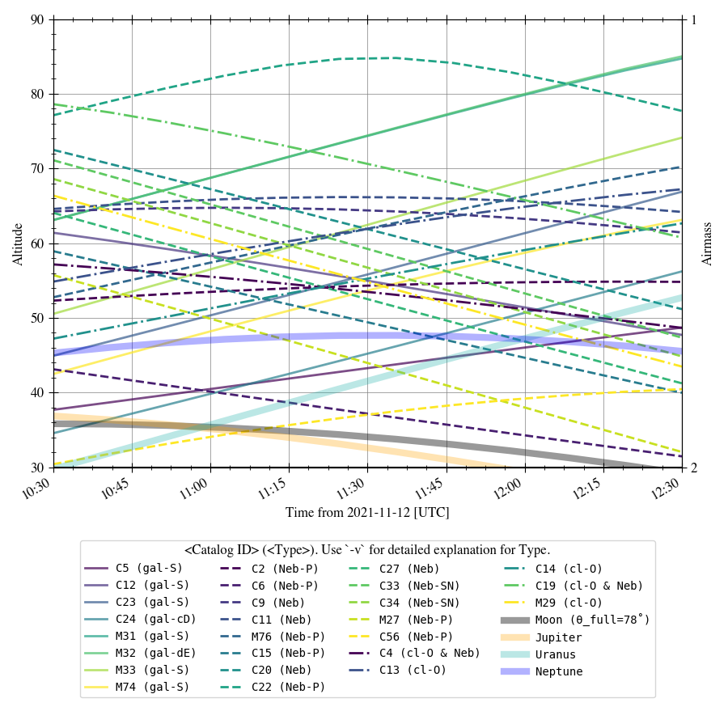
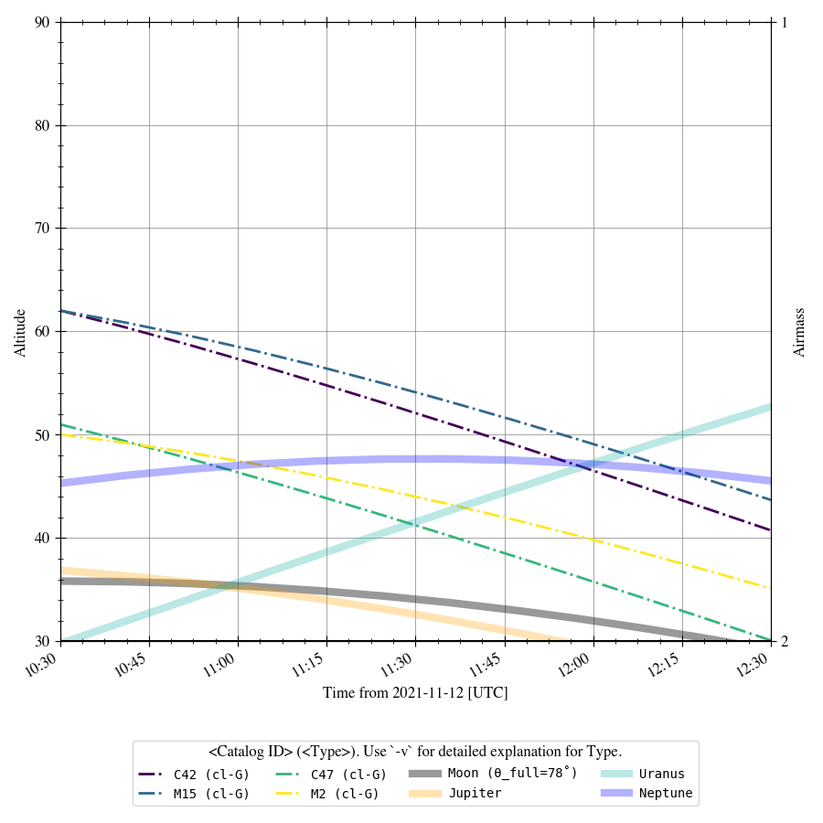
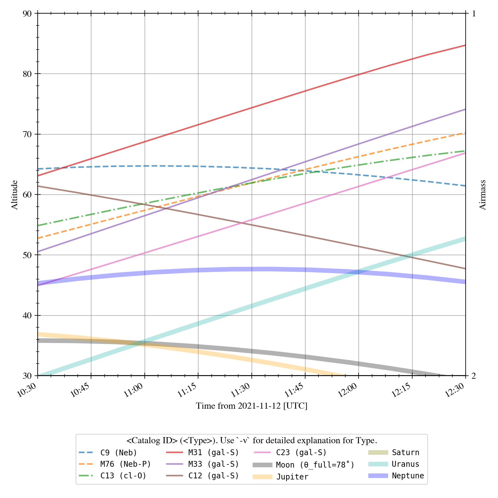

# find_amateur_astro_target
Yoonsoo P. Bach (@ysBach)

Finds which **amateur astronomy targets** that are above the horizon at given time, and showing the altitude/airmass plot.

Catalogs supported at this moment are [Messier](https://en.wikipedia.org/wiki/Messier_object) and [Caldwell](https://en.wikipedia.org/wiki/Caldwell_catalogue).


<details><summary>"공개행사"</summary>

This work is derived from the "**서울대학교 천문대 공개행사**" (by SNU astro), a subproject of "**서울대학교 연구성과사회환원 프로그램**" (by SNU)

* "SNU": Seoul National University, South Korea
* "astro": Department of Physics and Astronomy, Astronomy program

Therefore, the default location/timezone is at Seoul, South Korea.

</details>


## Install 

<details> 
<summary> Dependency </summary>
You need:

* python 3.6+
* pytz
* numpy
* pandas
* astropy
* astroquery
* **astroplan**
* matplotlib
* rich (optional)

</details>

First, **install** Anaconda/miniconda (You may also make a new environment if you wish). Then run this:

```
$ conda install -c conda-forge rich numpy pandas matplotlib pytz astropy astroquery astroplan --yes
```


The very first, **test run**:

```
$ cd <where you want to save it>
$ git clone https://github.com/ysBach/find_amateur_astro_target.git
$ cd find_amateur_astro_target
$ python find_targets.py -o first_trial.html -t M31
```


## Usage

### 1. The simplest example

```
$ python find_targets.py
```

It will use all ~200 targets, using the **current time ± 2 hour at Seoul**. Any object above minimum altitude 30˚ will be plotted.


Few of the most widely used examples can be:

```
$ python find_targets.py YYYY MM DD HH mm ss -d 1 -vA -M
$ python find_targets.py YYYY MM DD HH mm ss -d 2 -vA -t M31 M1 M5
$ python find_targets.py YYYY MM DD HH mm ss -d 2 -vA --min-alt 15 --currentlocation
```


### 2. Practical usage for 공진단

#### 2-1. First run

First, check for ALL the objects above the horizon on the day. I will test with 

* 2021-11-12 20:30:00 [KST] (given by ``2021 11 12 20 30``) 
* duration of ± 1 hour (given by `-d 1`)
* I want to see only those are above 30˚ ALL the time (use `-A`)
* I want to remove those without common nickname (use `-N`)
* save all target list as ``test.html`` (`-o test.html`)
* use verbose option (`-v`)

```
$ python find_targets.py 2021 11 12 20 30 00 -o first.html -d 1 -v -A -N
```

Output:

```
Abbreviations for "Type" column
[...]

Date & Time : 2021-11-12 20:30:00+09:00 (Asia/Seoul)
 lon , lat  : 127.00˚, 37.50˚
96 objects are selected by the user.
26 objects are visible by the user's criteria.
Catalog saved to first.html
3 planets are visible under the user's criteria.
```

The plot is messy, but it is intended (because there are 26 objects!).



* **NOTE**: line style is grouped based on the type of the objects (cluster, neubla, galaxy, otehrs)
* **NOTE**: For the Moon, ``θ_full`` means the 180˚ - (Sun-Earth-Moon angle), i.e., the angle for the Moon to travel to become a full moon.

The output HTML will look something like this:


It shows the ID (C: Caldwell, M: Messier), NGC/IC IDs, common names, etc. On top of these, it gives you **link to Wikipedia**, and the **35'x35' view by DSS** in linear scale and zscale. The red boxes are 21'x21', which is the FoV of SNU-SAO 1m telescope with STX-16803.


#### 2-2. Check for Candidates

Now, considering the time limit and the interest of the audience (e.g., depending on the topic of the lecture given before the observation), **let's select few target candidates**. 

On 2021-11-12, we have a lecture on Sombrero galaxy (M104), but it is not visible, unfortunately. Similar galaxies, S/E types, can be chosen from the list above. I will select **M31** (Andromeda), **M33** (Pinwheel galaxy), **C12** (Fireworks galaxy), **C23** (Silver silver galaxy). Also, let me choose an open cluster that may be attractive to general audience, **C13** (Owl cluster). I will also add two nebulae, the Cave Nebula, **C9**, and Little Dumbbell nebula, **M76**.


#### 2-3. Find Missing "Type"s

Unfortunately, **we have no globular cluster**! Let's go back to the first step, but now loosen `-N` (select even though they have no common nickname), but add `-T cl-G` (only ``Type == 'cl-G'`` will be drawn):

```
python find_targets.py 2021 11 12 20 30 00 -o first-cl-G.html -d 1 -v -A -T cl-G
```



Considering both the images in `first-cl-G.html` and the altitude plot above, I think **M15** is a good choice.


#### 2-4. Finally: Specify Targets

Finally, select targets by `-t M31 M33 C12 C23 C13 C9 M76 M15`

```
$ python find_targets.py 2021 11 12 20 30 00 -o second.html -d 1 -v -t M31 M33 C12 C23 C13 C9 M76 M15
```

(No need to specify other flags. Even if you use other flags like `-ANT`, they'll be ignored.)

The plot looks simpler, but you have to note that M72 and M45 can be below altitude 30˚ (the lower limit for SNU-SAO 1m telescope) during the ± 1hour duration.



#### 2-5. Planning

Well, we have very many objects. **Moon**, **Jupiter**, **Saturn** are "must visit" objects. Thus, let me choose only five additional celestial objects: **M31** (Andromeda: as it will be mentioned in the 2021-11-12's lecture), **C23** (Silver Silver galaxy: edge on galaxy similar to Sombrero, the main topic of 2021-11-12's lecture), **M15** (globular cluster: as it is also related to the 2021-11-12's lecture), **C13** (Owl open cluster), and a nebula, **C9** (Cave nebula). 

