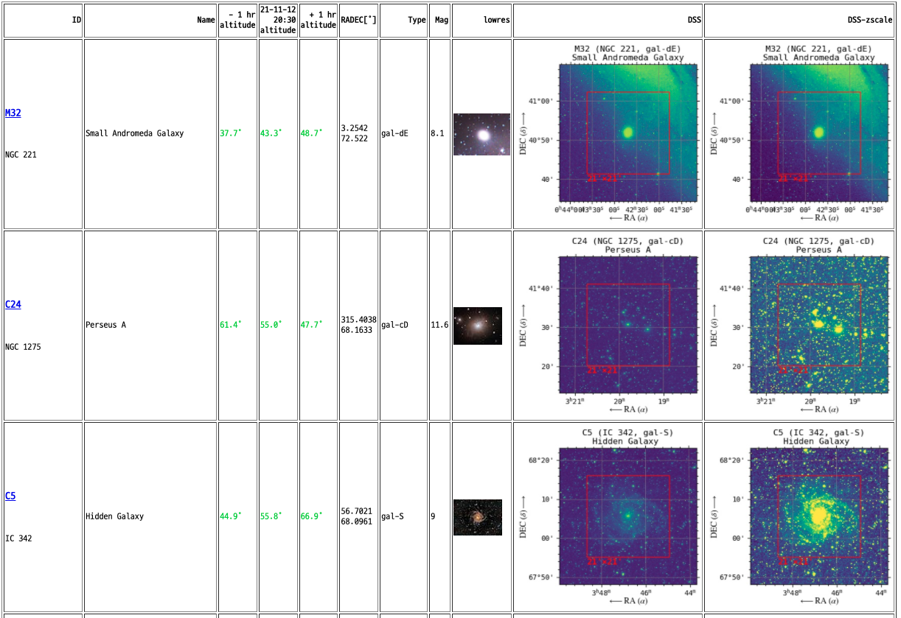
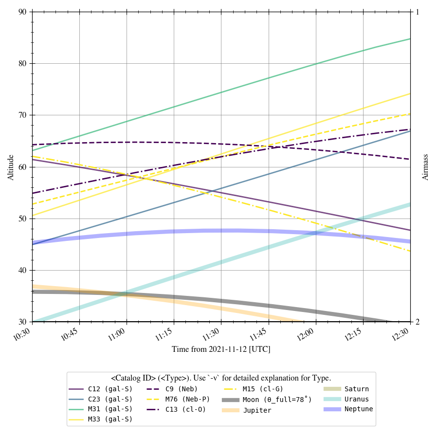

# find_amateur_astro_target
Yoonsoo P. Bach (@ysBach)

This work is derived from the "서울대학교 천문대 공개행사", a subproject of "서울대학교 연구성과사회환원 프로그램" at Seoul National University, S. Korea.


Find which **amateur astronomy targets** that are above the horizon at given time, and showing the altitude/airmass plot.

Catalogs supported at this moment are [Messier](https://en.wikipedia.org/wiki/Messier_object) and [Caldwell](https://en.wikipedia.org/wiki/Caldwell_catalogue).


Default location at Seoul, South Korea.


## Dependency

* python 3.6+
* pytz
* numpy
* pandas
* astropy
* **astroplan**
* matplotlib
* rich (optional)


### Install 

First, install Anaconda python distribution. Then all may have been installed, except for `astroplan`. Install it by:

```
$ conda install -c astropy astroplan
```


(OPTIONAL: Package `rich` is used for nothing but nicer output on terminal. You may install by `pip install rich`, but it is **not necessary**.)


To use this simple python script, du

```
$ cd <where you want to save it>
$ git clone https://github.com/ysBach/find_amateur_astro_target.git
$ cd find_amateur_astro_target
$ python find_targets.py -C  # slightly better
```

When you run the script for the ***first time***, it will take some time, like ***~ 5 minutes*** (as it tries to query the RA/DEC information of the objects from online).

You may play with it - see the Usage below.


## Usage

When you run the script for the ***first time***, it will take some time, like ***~ 5 minutes*** (as it tries to query the RA/DEC information of the objects from online).

```
usage: find_targets.py [-h] [-U] [-M] [-C] [-X] [-A] [-d DURATION] [-l LOCATION LOCATION] [-z TIMEZONE] [-c] [-v] [-a MIN_ALT] [-p MIN_ALT_PL] [-t TARGETS [TARGETS ...]] [-o OUTPUT]
                       [YYYY] [MM] [DD] [HH] [mm] [ss]

positional arguments:
  YYYY                  Year; If not given, current time is used
  MM                    Month (1 <= month <= 12)
  DD                    Date (1 <= day <= number of days in the given month and year)
  HH                    Hour (0 <= hour < 24)
  mm                    Minutes (0 <= minute < 60)
  ss                    Seconds (0 <= second < 60)

optional arguments:
  -h, --help            show this help message and exit
  -U, --UTC             Time is in UTC instead of local time
  -M, --Messier         Do NOT use Messier objects
  -C, --Caldwell        Do NOT use Caldwell objects
  -X, --airmass         Whether to use the primary y-axis as airmass (`X`)
  -A, --always-visible  Whether to discard objects that are not *always* visible during the timespan
  -d DURATION, --duration DURATION
                        Duration of the observing run (+- this number) [hour]
  -l LOCATION LOCATION, --location LOCATION LOCATION
                        (longitude, latitude) in degrees; Used in astropy.coordinates.EarthLocation
  -z TIMEZONE, --timezone TIMEZONE
                        Time zone
  -c, --currentlocation
                        Use current location and timezone automatically (using http://ip-api.com/json/)
  -v, --verbose         Print miscellaneous information
  -a MIN_ALT, --min-alt MIN_ALT
                        Minimum altitude of the object to be drawn [deg]
  -p MIN_ALT_PL, --min-alt-pl MIN_ALT_PL
                        Minimum altitude of the planetary objects to be drawn [deg]
  -t TARGETS [TARGETS ...], --targets TARGETS [TARGETS ...]
  -o OUTPUT, --output OUTPUT
                        HTML name to save DataFrame
```


## Example

### The simplest example

```
$ python find_targets.py
```

It will use all ~200 targets, using the current time ± 2 hour at Seoul. Any object above minimum altitude 30˚ will be plotted.


### Practical usage for 공진단

First, check for ALL the objects above the horizon on the day. I will test with 

* 2021-11-12 20:30:00 [KST] (given by ``2021 11 12 20 30``) 
* duration of ± 1 hour (given by `-d 1`)
* do ***NOT*** plot Caldwell catalog (use `-C`)
* save all target list as ``test.html`` (`-o test.html`)
* use verbose option (`-v`)

```
$ python find_targets.py 2021 11 12 20 30 00 -o test.html -d 1 -v -C
```

This is messy, but it is intended.


* **NOTE**: line style is grouped based on the type of the objects (cluster, neubla, galaxy, otehrs)
* **NOTE**: For the Moon, ``θ_full`` means the 180˚ - (Sun-Earth-Moon angle), i.e., the angle for the Moon to travel to become a full moon.

The output HTML looks like this:



Then, considering the time limit and the interest of the audience (e.g., depending on the topic of the lecture given before the observation), **let's select few targets**. 

On 2021-11-12, we have a lecture on Sombrero galaxy (M104), but it is not visible, unfortunately. Similar galaxies, S/E types, can be chosen from the list above. I will select M31, M32, M110. Also, let me choose some globular clusters that are attractive to general audience, M72, and an open cluster M45.

* Select targets by `-t M31 M32 M110 M72 M45`

```
$ python find_targets.py 2021 11 12 20 30 00 -o test.html -d 1 -v -C -t M31 M32 M110 M72 M45
```

The plot looks simpler, but you have to note that M72 and M45 can be below altitude 30˚ (the lower limit for SNU-SAO 1m telescope) during the ± 1hour duration.


